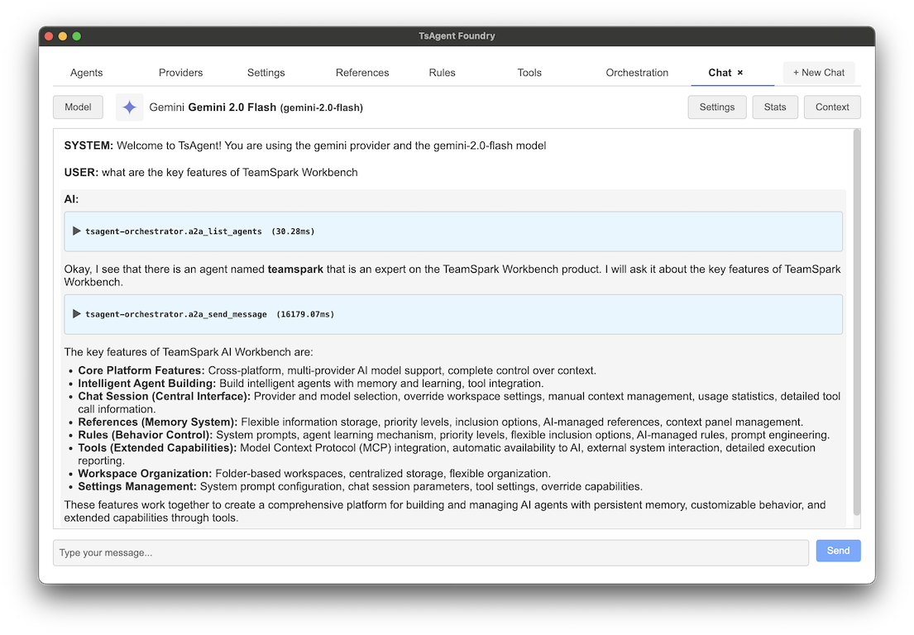
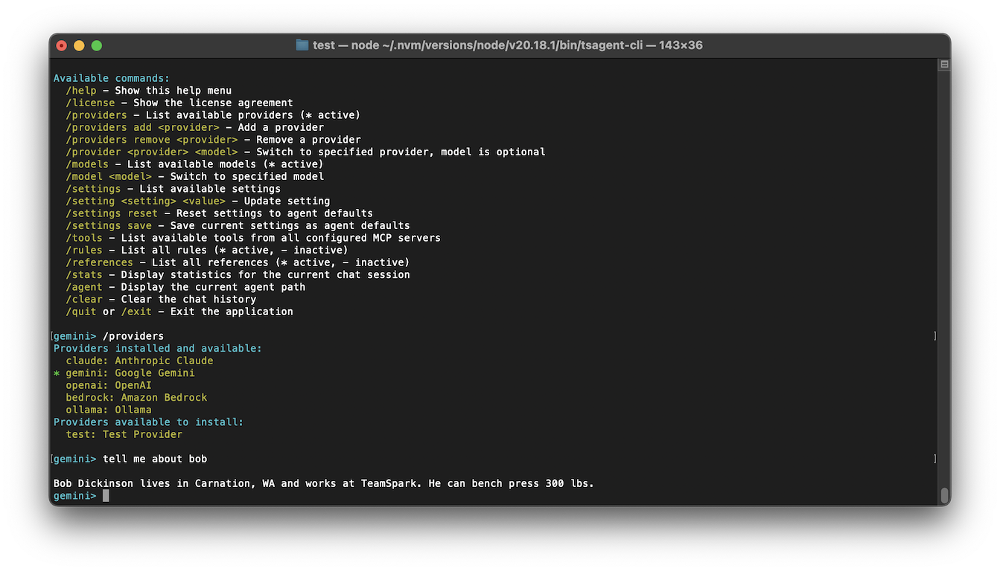

[](https://www.npmjs.com/package/@tsagent/core)
[](https://github.com/TeamSparkAI/tsagent/blob/main/LICENSE.md)
[](https://github.com/TeamSparkAI/tsagent/stargazers)
[](https://discord.gg/Z2dh4ATXnB)

# TsAgent: The TypeScript Agent Platform

**TsAgent** is an open-source TypeScript-first platform for building, testing, running, and orchestrating AI agents. It provides a complete ecosystem from desktop and CLI apps for no-code agent creation, to production-ready agent servers, all supported by TypeScript APIs.

For more information, see the [TeamSpark web page for TsAgent](https://www.teamspark.ai/tsagent).

## What is TsAgent?

TsAgent is a comprehensive platform that enables anyone to:

- **Build Agents**: Create no-code AI agents through a visual interface (Foundry), CLI, or via API
- **Support Any Provider**: Work with all major LLM providers, cloud, hosted, and local (OpenAI, Anthropic, Google, AWS Bedrock, Ollama)
- **Manage Context**: Use references (memory, ground truth) and rules (prompt guidance) to give agents persistent knowledge
- **Integrate Tools**: Connect thousands of tools via Model Context Protocol (MCP) support
- **Orchestrate Workflows**: Chain agents together using the A2A (Agent-to-Agent) protocol
- **Deploy at Scale**: Expose agents as A2A endpoints or embed them in any TypeScript/Javascript application


## Platform Components

| Component | Package Name | Delivery Method | Description |
|-----------|-------------|-----------------|-------------|
| **Core API** | [`@tsagent/core`](https://www.npmjs.com/package/@tsagent/core) | TypeScript Library | TypeScript agent framework for building, testing, and running agents programmatically |
| **Foundry** | *(no npm package)* | Desktop App | No-code desktop application for creating, testing, and managing agents |
| **CLI** | [`@tsagent/cli`](https://www.npmjs.com/package/@tsagent/cli) | CLI Tool | Command-line interface for agent operations and automation <br>`tsagent-cli` |
| **A2A Server** | [`@tsagent/server`](https://www.npmjs.com/package/@tsagent/server) | API/CLI | A2A protocol server for exposing agents as HTTP endpoints <br>`tsagent-server` |
| **A2A Orchestrator** | [`@tsagent/orchestrator`](https://www.npmjs.com/package/@tsagent/orchestrator) | MCP Server | MCP server for orchestrating A2A agent servers <br>`tsagent-orchestrator` |
| **Meta MCP** | [`@tsagent/meta-mcp`](https://www.npmjs.com/package/@tsagent/meta-mcp) | MCP Server | MCP server that exposes Tools agents as MCP tools with cognitive layer <br>`tsagent-meta-mcp` |
| **Agent Management MCP** | [`@tsagent/agent-mcp`](https://www.npmjs.com/package/@tsagent/agent-mcp) | MCP Server | MCP server for managing TsAgent agents (create, configure, manage rules, references, tools, providers, and MCP servers) <br>`tsagent-agent-mcp` |

| TsAgent Foundry | TsAgent CLI |
|-----------------|-------------|
| [](docs/images/desktop.png) | [](docs/images/cli.png) |

## Installation

### TsAgent Foundry - Desktop Application

Download the pre-built installer for your platform:

- [macOS (Intel)](https://storage.googleapis.com/tsagent/TsAgent%20Foundry-latest.dmg)
- [macOS (Apple Silicon)](https://storage.googleapis.com/tsagent/TsAgent%20Foundry-latest-arm64.dmg)
- [Linux (Debian/Ubuntu)](https://storage.googleapis.com/tsagent/tsagent-foundry_latest_amd64.deb)
- [Linux (AppImage)](https://storage.googleapis.com/tsagent/TsAgent%20Foundry-latest.AppImage)

### TsAgent CLI and Developer Tools (NPM Packages)

```bash
# Install all developer tools
npm install @tsagent/core @tsagent/cli @tsagent/server @tsagent/orchestrator @tsagent/meta-mcp @tsagent/agent-mcp

# Or install individual components
npm install @tsagent/core  # Just the TypeScript library
npm install @tsagent/cli   # Just the CLI tool
npm install @tsagent/meta-mcp  # MCP server for Tools agents
npm install @tsagent/agent-mcp  # MCP server for agent management
```

## Quick Start

### Create Your First Agent

Launch the TsAgent Foundry desktop app (after downloading and installing)

Or create an agent via CLI by either running the CLI in the directory of the desired agent (or new agent)
or passing the agent directory to the CLI as the `--agent` argument.  Use `--create` to create a new agent.

```bash
npx @tsagent/cli --agent ./my-agent --create
```

### Use Agents Programmatically

```typescript
import { loadAgent } from '@tsagent/core';

// Load an existing agent
const agent = await loadAgent('./my-agent', logger);

// Create a chat session
const session = agent.createChatSession('session-1');

// Send a message
const response = await session.handleMessage('Hello, how can you help me?');
console.log(response.updates[1].modelReply);
```

### Deploy Agents as Services

```bash
# Start an A2A server (for Autonomous agents)
npx @tsagent/server /path/to/agent --port 3000
# or if installed globally
tsagent-server /path/to/agent --port 3000

# Your agent is now available at http://localhost:3000
```

### Expose Tools Agents as MCP Tools

```bash
# Start a Meta MCP server (for Tools agents)
npx @tsagent/meta-mcp /path/to/tools-agent
# or if installed globally
tsagent-meta-mcp /path/to/tools-agent

# The agent's tools are now available as MCP tools
# Configure in Claude Desktop or other MCP clients
```

### Manage Agents via MCP

```bash
# Start the Agent Management MCP server
npx @tsagent/agent-mcp
# or if installed globally
tsagent-agent-mcp

# Provides tools to create, configure, and manage agents
# Configure in Claude Desktop or other MCP clients
```

### Secret Management & 1Password Support

- Secret fields (and “credential” fields such as API key IDs) can store direct values, environment variables, or 1Password references.
- `.env` files are loaded (with override priority) from both the current working directory and the agent directory, so you can keep provider-specific secrets near each agent if desired.
- 1Password support is automatically enabled when either `OP_SERVICE_ACCOUNT_TOKEN` or `OP_CONNECT_TOKEN` is present in the environment (you can also set `OP_CONNECT_HOST` when using Connect to override the default value of localhost:8080). These values can also live in the same `.env` files.
- When 1Password is available, the desktop UI lets you choose **Direct**, **Environment Variable**, or **1Password** for each secret field, and provides a picker to browse vaults/items/fields (returning standard `op://` references).
- At runtime and during provider validation TsAgent resolves `env://` and `op://` values before passing configs to providers
- Credentials are never logged or stored in plain text.

## Agent Types

TsAgent supports three types of agents:

- **Interactive Agents**: Maintain conversation history and can ask for user permission to use tools
- **Autonomous Agents**: Process requests independently and return complete results without user interaction (exposed via A2A protocol)
- **Tools Agents**: Expose agent capabilities as MCP tools, where each tool call executes a prompt template via a headless chat session

Also, any agent can orchestrate other agents (whether it is interactive or autonomous itself) via the TsAgent Orchestrator MCP server, and Tools agents can be exposed via the Meta MCP server to make them available as tools to other agents or MCP clients.


## Development Workflow

1. **Create Agent** - Use TsAgent Foundry desktop app or CLI for no-code agent creation
2. **Build Agent** - Write prompts, engineer context (rules/references), and add relevant MCP tools
3. **Test Agent** - Chat with your agent to refine its behavior
4. **Orchestrate** - Chain agents together using the A2A protocol
5. **Deploy** - Embed agents in applications via the `@tsagent/core` API or expose agents as A2A servers

## License

This project is licensed under the MIT License - see the [LICENSE](LICENSE.md) file for details.

## Contributing

We welcome contributions! Please see our [Contributing Guide](CONTRIBUTING.md) for details.

## Support

- **Issues**: [GitHub Issues](https://github.com/TeamSparkAI/tsagent/issues)
- **Discussions**: [GitHub Discussions](https://github.com/TeamSparkAI/tsagent/discussions)
