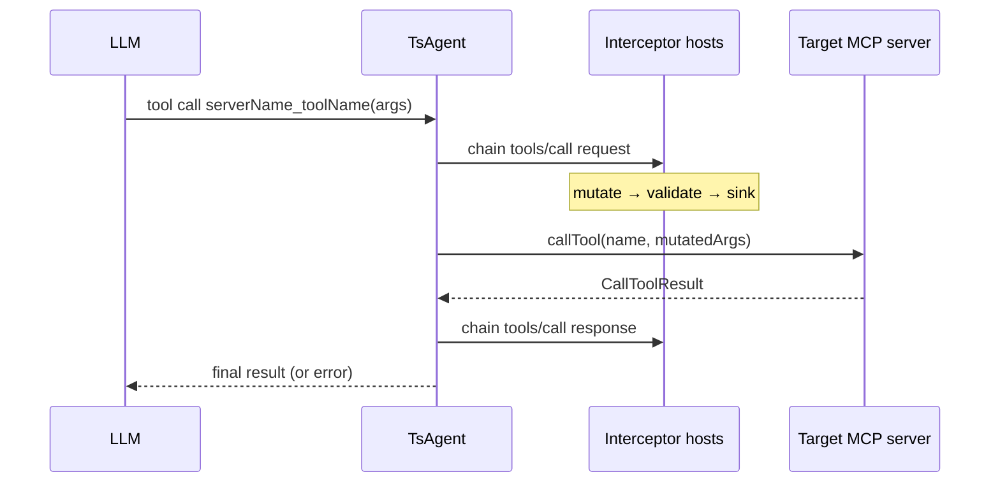

# MCP Interceptor Support in TsAgent

This document describes design goals and an implementation plan for [SEP-1763](https://github.com/modelcontextprotocol/modelcontextprotocol/issues/1763) interceptor support in TsAgent. It is based on the reference implementation in the sibling repository [`experimental-ext-interceptors`](https://github.com/modelcontextprotocol/ext-interceptors) (local path: `../experimental-ext-interceptors`) and its TypeScript SDK (`@ext-modelcontextprotocol/interceptors`).

## Status

**Implemented (v1)** — core orchestration in `@tsagent/core`, desktop Tools tab UX. See implementation phases below; Phase 3 hardening remains open.

## Background

### What interceptors are

Interceptors are an MCP extension primitive (draft [SEP-1763](https://github.com/modelcontextprotocol/modelcontextprotocol/issues/1763)) for governance at lifecycle events such as `tools/call`. An **interceptor host** is a normal MCP server that exposes:

| Method | Purpose |
|--------|---------|
| `interceptors/list` | Discover registered interceptors and their hooks |
| `interceptor/invoke` | Run a single interceptor for an event + phase |

Interceptor types:

- **Validation** — pass/fail with severity and messages; can block the operation
- **Mutation** — transform request or response payloads (ordered by `priorityHint`)
- **Sink** — observe-only, non-blocking (logging, metrics)

Each interceptor declares **hooks**: which **events** (e.g. `tools/call`) and which **phase** (`request` or `response`) it handles. **Chain execution** (client-side orchestration) runs mutations sequentially, validations in parallel, then sinks fire-and-forget, following SEP ordering rules.

### Reference TypeScript SDK

The experimental repo ships a complete SDK at `experimental-ext-interceptors/typescript/sdk`:

| API | Role |
|-----|------|
| `listInterceptors`, `invokeInterceptor`, `executeInterceptorChainOnClient` | Wire calls + single-host chain |
| `executeInterceptorChainOnClients` | Multi-host list/merge + SEP-ordered `executeInterceptorChain` |
| `InterceptorChainRunner` | Convenience wrapper around `executeInterceptorChainOnClients` (gateway, `InterceptingMcpClient`) |
| `InterceptingMcpClient` | Wraps a backend client; runs chains on `callTool` (and other operations) |
| `McpInterceptorGateway` | Transparent MCP proxy (server toward clients, clients toward backend + interceptors) |

TsAgent uses **`executeInterceptorChainOnClients`** for multi-host tool interception (not the transparent gateway), because TsAgent is already the MCP **client** that invokes tools on behalf of the LLM.

Until `@ext-modelcontextprotocol/interceptors` is published, depend on the sibling project directly (see [Dependency wiring](#dependency-wiring)).

## Design goals

1. **Same configuration surface as tools** — Interceptor hosts are configured as ordinary MCP servers under `mcpServers` in agent YAML and managed in the desktop **Tools** tab (add, edit, connect, env, stdio/SSE/HTTP). No separate “interceptors config file” in TsAgent.

2. **Runtime composition, not a proxy** — At tool invocation time, TsAgent discovers which configured servers are interceptor-capable and runs `tools/call` request/response chains around the actual tool call. The LLM still sees a single flat tool namespace (`serverName_toolName`); interceptors are infrastructure, not model-facing tools.

3. **SDK fidelity** — Use the experimental TypeScript SDK for protocol types, chain ordering, validation/mutation semantics, and error types. Do not reimplement chain logic in TsAgent.

4. **Minimal schema churn** — Avoid new top-level agent YAML sections until we have a concrete need (e.g. global enforce/audit defaults). Prefer behavior driven by discovery (`interceptors/list`) and optional per-server metadata later.

5. **Clear failure modes** — Validation failures surface as tool errors the session can record; mutation and timeout behavior match SDK defaults (`McpInterceptorValidationException`, `throwChainFailure`).

6. **Works everywhere tools run** — Interception applies to all code paths that execute MCP tools: LangChain/LangGraph runners, direct `ProviderHelper.callTool`, desktop tool test UI, and future CLI/server surfaces that share `@tsagent/core`.

7. **Visible operator UX** — The Tools tab shows which servers are interceptor hosts (badge), and lets operators inspect registered interceptors (list in server detail) without a separate configuration surface.

## Non-goals (initial release)

- **Transparent proxy mode** (`McpInterceptorGateway`) — Not required; TsAgent orchestrates in-process.
- **`llm/completion` interception** — SDK has types only; TsAgent does not wire LLM completion hooks yet.
- **Hosting interceptors** — TsAgent is a consumer of interceptor hosts, not an interceptor server author (no `registerInterceptorsOnServer` in product code).
- **C# `extensions["interceptors"]` capability shape** — TypeScript SDK uses SEP `capabilities.interceptor`; discovery via `interceptors/list` is authoritative.
- **Publishing the interceptors package** — Track upstream; switch from `file:` to npm when stable.

## Architecture overview



TsAgent sits in the same role as `InterceptingMcpClient` in the SDK: **client orchestrator** between interceptor host(s) and the backend server that owns the tool.

### Server roles

| Role | Configured in `mcpServers` | Exposed to LLM as tools | Participates in interceptor chains |
|------|----------------------------|-------------------------|-----------------------------------|
| **Tool server** | Yes | Yes (subject to include/permission) | No |
| **Interceptor host** | Yes | No | Yes (if `interceptors/list` succeeds) |
| **Internal** (`type: internal`) | Yes | Yes (rules, references, etc.) | No |

A single physical MCP process could theoretically expose both tools and interceptors; TsAgent should still classify it using discovery (see below) and only feed **tool** capabilities into the model context.

## Configuration model

### Serialization

No change to the existing `mcpServers` record shape in agent YAML:

```yaml
mcpServers:
  pii-guard:
    type: stdio
    command: npx
    args: ["tsx", "path/to/interceptor-server.ts"]
  filesystem:
    type: stdio
    command: ...
```

Interceptor hosts use the **same** `McpServerConfig` discriminated union (`stdio` | `sse` | `streamable-http` | `internal`) as today. There is no `role: interceptor` field in v1; role is inferred at runtime.

### Optional future extensions

If product needs exceed discovery-only classification, consider **optional** fields (backward compatible):

- `serverRole?: 'tools' | 'interceptor' | 'both'` — User override when auto-detection is wrong
- `interceptorOrder?: number` — Stable ordering among interceptor hosts (default: YAML key order)
- `interceptorEvents?: string[]` — Limit which events TsAgent runs through this host (default: `['tools/call']` for v1)

These are **not** required for the first implementation.

## Discovery and classification

### When

Run classification when an MCP client **successfully connects** (in `MCPClientManagerImpl.loadMcpClient` or immediately after `McpClientBase.connect`).

### How

1. After `initialize`, call `listInterceptors(mcpClient)` from the SDK (using the underlying `@modelcontextprotocol/sdk` `Client` held by `McpClientBase`).
2. If the call succeeds (including empty `{ interceptors: [] }`), mark the server as an **interceptor host** and cache descriptor metadata for logging/UI.
3. If the method is unsupported or errors with “method not found”, treat the server as a **tool-only** server (current behavior).

Do **not** rely on `getServerCapabilities().interceptor` from the stock v1 MCP client parser — the SDK design doc notes it is often undefined on the wire even when advertised. **`interceptors/list` is the reliable probe.**

### Caching

Store per server name on the manager or client wrapper:

```ts
interface InterceptorHostInfo {
  isInterceptorHost: boolean;
  interceptors: Interceptor[];  // from list
  supportedEvents: Set<string>; // derived from hooks
}
```

Refresh when the client is reloaded (connection settings changed) or on explicit reconnect.

### Tool catalog exclusion

`ProviderHelper.getIncludedTools` (and semantic search over tools) must **exclude** servers classified as interceptor-only hosts so validators/sinks never appear as `serverName_toolName` in the model tool list.

If a server is **both** tool and interceptor host, include its tools in the catalog **and** include it in interceptor chains (rare; document as advanced).

## Runtime: tool invocation pipeline

### Single choke point

All tool execution flows through `ProviderHelper.callTool` today:

```121:132:packages/agent-api/src/providers/provider-helper.ts
    static async callTool(agent: Agent, name: string, args?: Record<string, unknown>, session?: ChatSession): Promise<CallToolResultWithElapsedTime> {
        const clientName = ProviderHelper.getToolServerName(name);
        const toolName = ProviderHelper.getToolName(name);
        const client = await agent.getMcpClient(clientName);
        // ...
        return client.callTool(tool, args, session);
    }
```

Interceptor orchestration belongs **here** (or in a dedicated module called from here), not duplicated in LangGraph/LangChain runners.

### Proposed flow (`ProviderHelper.callTool`)

1. Resolve `clientName`, `toolName`, backend `McpClient`, and `Tool` definition (unchanged).
2. Build request payload for interceptors (match SDK / `InterceptingMcpClient`):

   ```ts
   { name: toolName, arguments: args ?? {} }
   ```

   Note: interceptor payload uses the **backend tool name**, not the qualified `clientName_toolName` string.

3. **Request phase** — `executeInterceptorChainOnClients` with merged interceptors from all hosts; SDK applies SEP order (**mutations → validations → sinks**).

4. Apply mutated payload — If chain returns `finalPayload`, parse `{ name, arguments }` and use for the backend call (same as `InterceptingMcpClient.callTool`).

5. **Backend call** — `backendClient.callTool(tool, mutatedArgs, session)` (unchanged timing/elapsed ms behavior).

6. **Response phase** — Same `executeInterceptorChainOnClients` call with `phase: 'response'` (SDK SEP order: validations → sinks → mutations). Payload is MCP-shaped `CallToolResult` only (strip TsAgent’s `elapsedTimeMs` before sending to interceptors).

7. Return `CallToolResultWithElapsedTime` to callers.

### Interceptor context

Populate `InvokeInterceptorContext` for observability and policy:

| Field | Source |
|-------|--------|
| `sessionId` | Chat session id when available |
| `traceId` / `spanId` | Optional; generate per tool call if no distributed trace |
| `principal` | Future: agent user / API key identity |
| `timestamp` | ISO time at invocation |

Pass through SDK chain params on every invoke.

### Ordering multiple interceptor hosts

Host **declaration order** affects merge order and `duplicateNamePolicy: 'first-wins'` tie-breaking. **Phase ordering** is enforced globally across hosts by `executeInterceptorChainOnClients` → `executeInterceptorChain`.

Document that operators should list policy interceptors (e.g. PII, authz) before audit sinks when order matters across hosts.

### Events (v1 scope)

| Event | v1 |
|-------|-----|
| `tools/call` request + response | **Yes** — primary use case |
| `tools/list` | Optional later (tool catalog hygiene) |
| `resources/read`, `prompts/get`, `llm/completion`, etc. | Future |

## SDK integration details

### Modules to import

From `@ext-modelcontextprotocol/interceptors` (local path until published):

- `executeInterceptorChainOnClients` — primary runtime API in TsAgent for tool calls
- `listInterceptors` — discovery and desktop refresh
- `InterceptionEvents` — event constants
- Error types: `McpInterceptorValidationException`, `McpInterceptorChainException`

### Access to MCP `Client`

`McpClientBase` already owns `protected mcp: Client`. Expose a read-only accessor for interceptor wiring:

```ts
getMcpSdkClient(): Client  // used only by interceptor orchestration
```

Internal MCP clients (`rules`, `references`, `supervision`, `tools`) either return a client that fails `interceptors/list` or skip interceptor probing entirely.

### Dependency wiring

In `packages/agent-api/package.json` (and desktop if it bundles core separately):

```json
"@ext-modelcontextprotocol/interceptors": "file:../../../experimental-ext-interceptors/typescript/sdk"
```

Requirements:

- Build the SDK (`npm run build` in `typescript/sdk`) before TsAgent builds, or add a prepublish script.
- Align `@modelcontextprotocol/sdk` peer version with TsAgent’s existing SDK dependency (^1.x).

When the package is published, replace `file:` with a semver range.

### New code layout (agent-api)

Suggested module: `packages/agent-api/src/mcp/interceptor-orchestrator.ts`

Responsibilities:

- Resolve ordered interceptor host clients from `MCPClientManager` + cached `InterceptorHostInfo`
- Run request/response chains via SDK
- Map SDK failures to `CallToolResult` `isError: true` content for the session transcript
- Logging at info/debug for chain status and interceptor names

`ProviderHelper.callTool` delegates to this module when at least one interceptor host is registered and connected.

## UI and operator experience

### Principles

- **No separate “Interceptors” tab** — Interceptor hosts live in the existing **Tools** tab beside tool servers.
- **Discovery-driven labels** — Badges and lists reflect cached `InterceptorHostInfo` from connect-time `interceptors/list`, not a manual “this is an interceptor” toggle.
- **Reuse server detail panel** — Interceptor metadata appears in the same right-hand **Details** area as connection status, type, and command (today’s server summary when no tool is selected).

### Server list (left column)

Each configured server row shows:

| Element | When | Appearance |
|---------|------|------------|
| **Interceptor badge** | `isInterceptorHost === true` after connect probe | Pill next to server name, e.g. `Interceptor` — distinct color from tool include badges (e.g. purple `#7c4dff` vs orange/blue used for Manual/Agent) |
| **Tool count hint** | Interceptor-only host | Optional subtitle: `0 tools` or omit tool count; do not imply the server is broken |
| **Connected / disconnected** | Unchanged | Existing connection behavior |

Badge is hidden until the server has been connected at least once (or after explicit Connect), because classification requires `interceptors/list`.

### Server detail panel (right column, no tool selected)

Extend the existing **Details** block (alongside Connected, Type, Command, etc.):

1. **Role line** (when classified):
   - `Interceptor host` — only interceptors, no tools in catalog
   - `Tools + interceptors` — rare dual-role server
   - (omit line for tool-only servers)

2. **View interceptors** button — visible when connected and `isInterceptorHost`:
   - Label: `View interceptors (N)` where `N` is `interceptors.length`, or `View interceptors` if zero
   - Action: toggles an **Interceptors** subsection in the detail panel (expand/collapse), or focuses it if already open
   - Does not navigate away from Tools tab

3. **Interceptors list** (shown when expanded or when host has interceptors and user opened the section):

   | Column | Content |
   |--------|---------|
   | Name | `interceptor.name` |
   | Type | `validation` / `mutation` / `sink` (badge) |
   | Hooks | Compact summary: e.g. `tools/call · request` per hook |
   | Mode | `active` / `audit` if set |
   | Priority | `priorityHint` if set |

   Empty list: message `No interceptors registered on this host` (host responded to `interceptors/list` but returned `[]`).

4. **Refresh** — Small control on the interceptors section to re-call `interceptors/list` (via IPC) without full reconnect; updates cache and badge count.

5. **Tool list (left half of split view)** — For interceptor-only hosts:
   - Replace empty tool list with short copy: *This server provides interceptors, not LLM tools. Interceptors run automatically when other servers’ tools are called.*
   - No tool test UI for interceptor-only servers

6. **Connection errors** — If user expects an interceptor (e.g. from docs) but `interceptors/list` fails, show in error log area: *Server does not support interceptors/list — treated as a tool-only server.*

### IPC / API surface (desktop)

Extend `getMCPClient` (or add `getInterceptorHostInfo`) return value:

```ts
interceptorHost?: {
  isInterceptorHost: boolean;
  interceptors: Interceptor[];  // serialized descriptors from core
  supportedEvents: string[];
};
```

`listInterceptors` refresh: `refreshInterceptorList(serverName: string)` on `window.api`.

Types for `Interceptor` can be re-exported from `@tsagent/core` (thin wrapper over SDK types) so the renderer stays typed.

### Tool test and chat

- **Tool test** (Tools tab, tool servers): runs full pipeline including interceptors (same as `ProviderHelper.callTool`) so operators verify policy before chat.
- **Chat**: no extra UI in v1; blocked tools show normal tool error content from validation failures.

### Agent YAML authoring

Operators add interceptor processes the same way as tool servers (see `experimental-ext-interceptors/typescript/sdk/examples/interceptor-server`). TsAgent does not spawn interceptor processes automatically unless we later add templates in the UI.

## Error handling and modes

| Outcome | Behavior |
|---------|----------|
| Request `validation_failed` | Abort tool call; surface chain result (`abortedAt`, validation messages) to model |
| Response validation failed | Abort returning success; surface error (may leave backend tool already executed — document) |
| Mutation failure / timeout | Per SDK `throwChainFailure` / chain status |
| `failOpen` on interceptor descriptor | Honor per SEP/SDK in chain orchestrator |
| `mode: audit` | Shadow validation/mutation per SDK |
| Interceptor host disconnected | **Fail closed** — abort tool call with error; do not skip silently (configurable override deferred) |
| No interceptor hosts | Direct `callTool` (zero overhead path) |

Surface interceptor failures in chat tool result messages similarly to MCP tool errors today so users see policy blocks in the transcript.

## Observability

- Log interceptor host name, event, phase, chain status, and duration at debug level
- Include `elapsedTimeMs` for backend call only in `CallToolResultWithElapsedTime`; optional future field for total interception overhead
- Consider a WORK_ITEMS entry for “Chat Debug” to show raw interceptor payloads

## Testing strategy

| Layer | Approach |
|-------|----------|
| Unit | Mock `InterceptorInvoker`; test payload mapping and host ordering without MCP |
| Integration | In-memory transport fixtures patterned on SDK `__tests__/fixtures/hosts.ts` |
| E2E | Desktop tool test or harness agent with `interceptor-server` example + echo backend |

Reuse SDK test interceptors (validator, mutator, sink) where possible.

## Implementation phases

### Phase 1 — Core plumbing

- Add SDK dependency and `getMcpSdkClient()`
- Discovery on connect; cache `InterceptorHostInfo`
- Exclude interceptor-only hosts from `getIncludedTools`
- `interceptor-orchestrator.ts` + hook in `ProviderHelper.callTool` for `tools/call`
- Unit/integration tests

### Phase 2 — Desktop UX

- Interceptor badge on server list rows
- Server detail: role line, **View interceptors** control, expandable interceptor table
- Extend `getMCPClient` / IPC with `interceptorHost` payload; `refreshInterceptorList`
- Interceptor-only empty tool list copy
- Document example agent YAML snippet in README / this doc

### Phase 3 — Hardening

- Settings: global `timeoutMs`, default `mode`, fail-open vs fail-closed when host offline
- Optional `tools/list` interception for catalog filtering
- CLI parity and chat debug visibility

## Design decisions

Recorded choices for implementation. Revisit only if product requirements change.

| Topic | Decision | Rationale |
|-------|----------|-----------|
| Multi-host orchestration | `executeInterceptorChainOnClients` with `duplicateNamePolicy: 'first-wins'` | SDK merges hosts then runs one SEP-ordered chain (not per-host full chains) |
| Response validation after backend call | Fail the tool result returned to the model; log backend result at debug | Avoid leaking policy-blocked content; backend may have already run |
| Response payload to interceptors | MCP `CallToolResult` without `elapsedTimeMs` | SEP-shaped payload; timing is TsAgent-internal |
| Tool test UI | Runs interceptors | Operators validate policy on Tools tab before chat |
| Autonomous vs interactive | Same interceptor behavior | Tool approval gates run **before** `callTool`; interceptors are not a substitute for permission UI |
| Offline interceptor host | Fail closed on tool call | Prevents silent policy bypass when a guard host is down |
| CI / workspace | Sibling clone: `experimental-ext-interceptors` next to `tsagent`; `file:` dependency in `package.json` | Matches local dev layout; document in build README |
| Desktop UX | Badge + **View interceptors** in server detail; no separate tab | Visible operator feedback without new navigation surface |

## References

- TsAgent MCP types: `packages/agent-api/src/mcp/types.ts`
- Tool invocation hub: `packages/agent-api/src/providers/provider-helper.ts`
- MCP client connect: `packages/agent-api/src/mcp/client.ts`, `client-manager.ts`
- Interceptors repo README: `../experimental-ext-interceptors/README.md`
- TypeScript SDK README and design plan: `../experimental-ext-interceptors/typescript/sdk/README.md`, `typescript/sdk/docs/design-and-implementation-plan.md`
- SEP draft: `../experimental-ext-interceptors/docs/sep.md`
- SDK examples: `../experimental-ext-interceptors/typescript/sdk/examples/`
